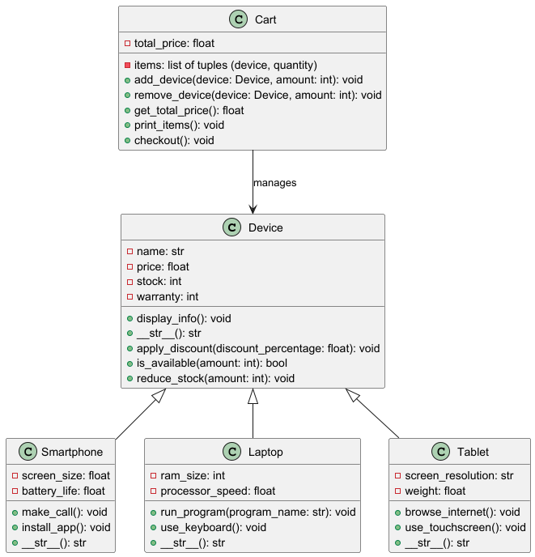

##Project Overview
The store offers different types of electronic devices: Smartphones, Laptops, and Tablets. Each device has unique attributes but shares common attributes like name, price, and stock. Customers can view available devices, add them to their cart, apply discounts, and proceed to checkout.

##Classes and Methods
1. Device (Base Class)
Attributes:

name: Name of the device (e.g., "iPhone 13", "MacBook Pro").
price: Price of the device.
stock: Number of units available in stock.
warranty: Warranty period of the device (in months).
Methods:

__init__(self, name, price, stock, warranty): Constructor to initialize the device attributes.
display_info(self): Displays the device information (name, price, stock, warranty).
__str__(self): Returns a string representation of the device.
apply_discount(self, discount_percentage): Applies a discount to the device price.
is_available(self, amount): Checks if the device is available in the specified quantity.
reduce_stock(self, amount): Reduces the stock by the specified quantity after a purchase.
2. Smartphone (Subclass of Device)
Attributes:

screen_size: Screen size in inches.
battery_life: Battery life in hours.
Methods:

__str__(self): Returns a string representation of the smartphone.
make_call(self): Simulates making a call.
install_app(self): Simulates installing an app.
3. Laptop (Subclass of Device)
Attributes:

ram_size: Amount of RAM in GB.
processor_speed: Processor speed in GHz.
Methods:

__str__(self): Returns a string representation of the laptop.
run_program(self, program_name): Simulates running a program on the laptop.
use_keyboard(self): Simulates typing on the laptop keyboard.
4. Tablet (Subclass of Device)
Attributes:

screen_resolution: Screen resolution (e.g., "2048x1536").
weight: Weight of the tablet in grams.
Methods:

__str__(self): Returns a string representation of the tablet.
browse_internet(self): Simulates browsing the internet.
use_touchscreen(self): Simulates using the touchscreen for navigation.
5. Cart
Attributes:

items: A list of tuples, each containing a device and its quantity.
total_price: The total price of all items in the cart.
Methods:

add_device(self, device, amount): Adds a specified quantity of a device to the cart if it is available in stock.
remove_device(self, device, amount): Removes a specified quantity of a device from the cart.
get_total_price(self): Returns the total price of all items in the cart.
print_items(self): Prints all devices in the cart with their quantities and total price.
checkout(self): Checks the availability of all items in the cart, reduces stock for purchased devices, and prints a receipt.
##How to Run the Code
Prerequisites:
Python 3.x
A text editor or IDE (e.g., PyCharm, VS Code)
Steps to Run:
Clone or download the repository to your local machine.
Open the project in your IDE or text editor.
Run the main.py file to interact with the shopping cart system.
Example:
bash
Copy
$ python main.py
This will start the interactive menu where you can view available devices, add them to your cart, and proceed with checkout.

##UML Class Diagram
Below is the UML Class Diagram for the shopping cart system.

##Sample Input/Output
Sample Run:
text
Copy
Welcome to the Electronic Device Store!
1. Show Devices
2. Show Cart
3. Exit

Enter your choice: 1

Available Devices:
1. iPhone 13 - $799 - Stock: 10
2. MacBook Pro - $2499 - Stock: 5
3. iPad Pro - $999 - Stock: 8

Enter the device number to add to the cart (1-3) or 0 to go back: 1

Enter quantity to add: 2

Device added to cart.

1. Show Devices
2. Show Cart
3. Exit

Enter your choice: 2

Your Cart:
1. iPhone 13 - Quantity: 2 - $1598

Total Price: $1598

1. Show Devices
2. Show Cart
3. Exit

Enter your choice: 3

Thank you for shopping with us!
Explanation:
The user first chooses to display the available devices.
The user adds 2 iPhones to their cart.
The user then checks their cart to see the total price.
Finally, the user exits the system.

## UML Class Diagram

